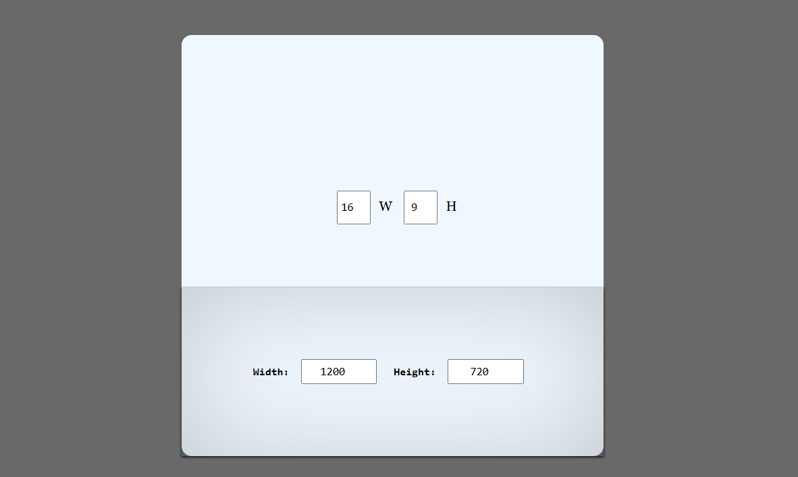

# 📏 Aspect Ratio Calculator  

The **Aspect Ratio Calculator** is a simple tool that helps you quickly determine the correct dimensions for images, videos, or designs while maintaining their aspect ratio. Perfect for designers, video editors, and developers!  

## 🚀 Features  
✅ **Instant Aspect Ratio Calculation** – Maintain proportions effortlessly  
✅ **Custom Width & Height Input** – Scale to any size you need  

✅ **Responsive & User-Friendly Interface** – Works on desktop and mobile  

## 🛠 Technologies Used  
- **Frontend:** HTML, CSS, JavaScript  
- **(Optional) Backend:** Node.js, Express.js for saving calculations  

## 📦 Installation & Usage


### 1️⃣ Clone the Repository  
```sh
git clone https://github.com/KIHs0/aspect-ratio-calculator.git


